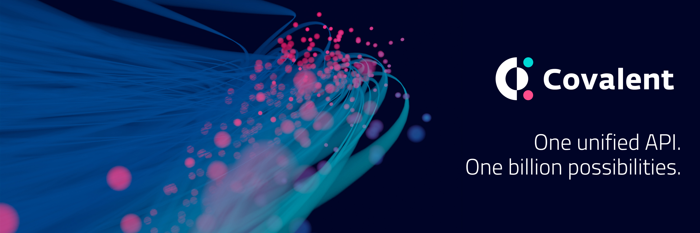
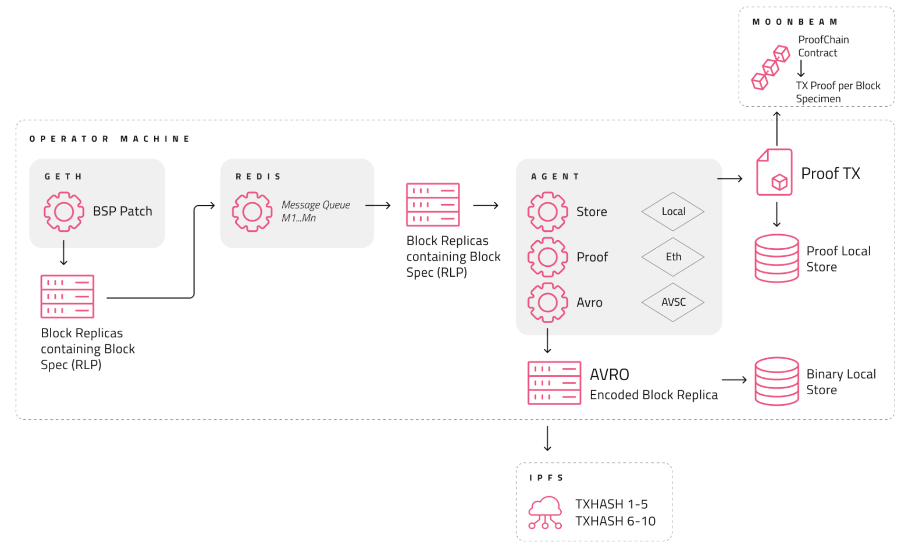

<div align="center">
  <a href="https://github.com/covalenthq/mq-store-agent/releases/latest">
    
  </a>
  <a href="https://github.com/covalenthq/mq-store-agent/blob/main/LICENSE">
    
  </a>
  <a href="https://goreportcard.com/report/github.com/covalenthq/mq-store-agent">
    
  </a>
  <!-- <a href="https://bestpractices.coreinfrastructure.org/projects/0000">
    
  </a> -->
  <a href="http://covalenthq.com/discord">
    
  </a>
</div>
<div align="center">
  <a href="http://covalenthq.com/discord">
    
  </a>
  <a href="https://github.com/covalenthq/mq-store-agent/actions/workflows/golangci-lint.yml?query=branch%3Amain+workflow%3Agolangci-lint">
    
  </a>
  <a href="https://github.com/covalenthq/mq-store-agent/actions/workflows/docker-image.yml?query=branch%3Amain+workflow%3Adocker-image-ci">
    
  </a>
  <a href="https://twitter.com/@Covalent_HQ">
    
  </a>
</div>

# BSP Agent (mq-store-agent)

* [Introduction](#agent_intro)
  * [Resources](#agent_resources)
* [Architecture](#agent_arch)
* [Block-Replica](#agent_block)
  * [State-Specimen](#state_specimen)
* [Environment](#environment)
* [Build & Run](#build_run)
  * [Flag Definitions](#flag_definitions)
* [Docker](#docker)
* [Scripts](#scripts)
  * [Inspect](#inspect)
* [Contributing](./docs/CONTRIBUTING.md)

## <span id="agent_intro">Introduction</span>

Decodes, packs, encodes, proves, stores and uploads block-replicas (can be block-results, block-specimens, or any other pre-defined block types), which are primarily "block-specimens" produced by EVM or non-EVM byte code based blockchains.

These block-replicas are produced by go-ethereum nodes / websocket block data sources modified with block-specimen producers(BSP) streamed into a redis channel. The agent first decodes them from their native RLP encoding, repacks them into segments of bigger chunks containing more than one block's worth of data, creates a proof transaction on the proof-chain smart contract (also called cqt-virtnet) with a sha-256 checksum of the data contained in the object, and finally persists them into object storage (local and cloud) for a specified google bucket - atomically.

## <span id="agent_resources">Resources</span>

Production of Block Specimen forms the core of the network’s data objects specification. These objects are created with the aid of three main pieces of open-source software provided by Covalent for the network’s decentralized stack.

1. [Block Specimen Producer (BSP Geth)](https://github.com/covalenthq/go-ethereum) - Operator run & deployed

1. [BSP Agent](https://github.com/covalenthq/mq-store-agent) - Operator run & deployed

1. [BSP Proof-chain](https://github.com/covalenthq/cqt-virtnet) - Covalent operated & pre-deployed

Please refer to these [instructions](https://docs.google.com/document/d/1N_HxUi6ZEkub9EHANe49vkL9iQztVA_ACyfHcOZV5y0/edit?usp=sharing) for running the BSP with the mq-store-agent (BSP Agent).

Please refer to this [whitepaper](https://www.covalenthq.com/static/documents/Block%20Specimen%20Whitepaper%20V1.1.pdf) to understand more about its function.

## <span id="agent_arch">Architecture</span>



## <span id="agent_block">Block-replica</span>

Block Replicas are created by the [BSP](https://docs.google.com/document/d/1BMC9-VXZfpB6mGczSu8ylUXJZ_CIx4ephepDtlruv_Q/edit#heading=h.5owqpz3w99gp) here and fed into [Redis streams](https://redis.io/topics/streams-intro).

These objects are extracted and read into the following struct by the agent. There are two types of block-replica objects currently -

For Ethereum -

```go
    type BlockReplica struct {
        Type            string
        NetworkId       uint64
        Hash            common.Hash
        TotalDifficulty *big.Int
        Header          *Header
        Transactions    []*Transaction
        Uncles          []*Header
        Receipts        []*Receipt
        Senders         []common.Address
        State           *StateSpecimen
    }
```

For Elrond -

```go
    type ElrondBlockReplica struct {
        Block        *Block
        Transactions []*ElrondTransaction
        SCResults    []*SCResult
        Receipts     []*ElrondReceipt
        Logs         []*Log
        StateChanges []*AccountBalanceUpdate
    }
```

### <span id="state_specimen">State-specimen</span>

The "State" is comprised of all state information related to accounts ever touched for a given block.

For Ethereum -

```go
    type StateSpecimen struct {
        AccountRead []*accountRead
        StorageRead []*storageRead
        CodeRead    []*codeRead
    }
    type accountRead struct {
        Address  common.Address
        Nonce    uint64
        Balance  *big.Int
        CodeHash common.Hash
    }
    type storageRead struct {
        Account common.Address
        SlotKey common.Hash
        Value   common.Hash
    }
    type codeRead struct {
        Hash common.Hash
        Code []byte
    }
```

For Elrond -

```go
    type AccountBalanceUpdate struct {
        Address []byte
        Balance []byte
        Nonce   int64
    }
```

## <span id="environment">Environment</span>

An Ethereum private key (for a public address that is pre-whitelisted on the staking contract) allows block-specimen producers (operators) to make proof transactions to the proof-chain contract and is required by the mq-store-agent. Other env vars are optional depending on your redis, eth account configuration. Add the following to your `.envrc` at the root dir with final relative path `~/mq-store-agent/.envrc`

```bash
    export ETH_PRIVATE_KEY=private/key/senders #required
    export REDIS_PWD=your-redis-password #optional
    export ETH_KEYSTORE_PATH=path/to/keystore/file.json #optional
    export ETH_KEYSTORE_PWD=password/to/access/keystore/file.json #optional
```

Please `brew install direnv` add the following to you bash -

```bash
    eval "$(direnv hook bash)" # bash users - add the following line to your ~/.bashrc
    eval "$(direnv hook zsh)" # zsh users - add the following line to your ~/.zshrc
```

And enable the vars with `direnv allow .`
For which you should see something like -

```bash
    direnv: loading ~/Documents/covalent/mq-store-agent/.envrc
    direnv: export +ETH_PRIVATE_KEY
```

The remaining environment configuration is set up with flags provided to the mq-store-agent during runtime.

## <span id="build_run">Build & Run</span>

Clone the `covalenthq/mq-store-agent` repo and checkout `main`

```bash
git clone git@github.com:covalenthq/mq-store-agent.git
cd mq-store-agent
git checkout main
```

Run the agent for (ethereum block-specimens) locally directly using the following -

```bash
go run ./cmd/mqstoreagent/*.go \
    --redis-url="redis://username:@localhost:6379/0?topic=replication#replicate" \
    --avro-codec-path="./codec/block-ethereum.avsc" \
    --binary-file-path="./bin/block-ethereum/" \
    --gcp-svc-account="/Users/<user>/.config/gcloud/<gcp-service-account.json>" \
    --replica-bucket="<covalenthq-geth-block-replica-bucket>" \
    --segment-length=1 \
    --eth-client="http://127.0.0.1:7545" \
    --proof-chain-address="0xb5B12cbe8bABAF96677F60f65317b81709062C47" \
    --consumer-timeout=80
```

Or update the Makefile with the correct --gcp-svc-account, --replica-bucket & --proof-chain-address and run with the following.

```bash
    make run-agent-eth
```

### <span id="flag_definitions">Flag definitions</span>

--redis-url - this flag tells the BSP agent where to find the BSP messages, the stream topic key `replication` and the consumer group name with the field after "#" that in this case is `replicate`, additionally one can provide a password to the redis instance here but we recommend that by adding the line below to the .envrc

```env
export REDIS_PWD=your-redis-pwd
```

`--avro-codec-path` - tells the BSP agent, the relative path to the AVRO .avsc files in the repo, since the agent ships with the corresponding .avsc files this remains fixed unless stated otherwise explicitly with another codec

`--binary-file-path` - tells the BSP agent if local copies of the block-replica objects being created are to be stored in a given local directory. Please make sure the path (& directory) pre-exists before passing this flag

`--gcp-svc-account` - sets the full path to the .json credentials file to the service account for the gcp bucket where the objects can be persisted

`--replica-bucket` - lets the BSP agent know the “bucket-name” for cloud storage of block replica specimens/results (currently only google cloud storege is supported)

`--segment-length` - allows the BSP operator to configure the size of each uploaded object (AVRO compression containing as many as specified block specimens in a single uploaded object)

`--eth-client` - specifies the ethereum client connection string used to make transactions to on proof-chain contract, the respective credentials to be able to write to the contract should be provided in the .envrc file as follows

```env
export ETH_PRIVATE_KEY=cef7c71eac8558cc2953a519f80f0cb2541e15a3b0760e848895a78fd842d5a5
```

`--proof-chain-address` - specifies the address of the proof-chain contract that has been deployed for the CQT network (local ethereum network for this workflow).

`--consumer-timeout` - specifies in how many seconds the BSP agent stops waiting for new messages from the redis pending queue for decode, pack, encode, proof, store and upload.

## <span id="docker">Docker</span>

Please install [docker and docker-compose](https://docs.docker.com/compose/install/).

Employ `docker-compose` to get all the necessary services along with the BSP agent to also get running along with the following, from root. Add a .env.dev file (if needed) to accomodate the env vars. The other services are -

1. redis-srv (Open source (BSD licensed), in-memory data structure store)
1. redis-commander-web (Redis web management tool written in node.js)
1. ganache-cli (Ethereum blockchain & client)
1. proof-chain (Validation (proofing) smart-contracts)

```bash
    cd mq-store-agent
    docker-compose -f "docker-compose.yml" --env-file .env.dev up --build --remove-orphans --force-recreate --exit-code-from consumer
```

The docker image for this service can be found [here](https://github.com/covalenthq/mq-store-agent/pkgs/container/mq-store-agent)

Run only the mq-store-agent with the following, though this will not work if the other services in the docker-compose.yml file aren't also initialized.

```bash
    docker pull ghcr.io/covalenthq/mq-store-agent:latest
    docker run ghcr.io/covalenthq/mq-store-agent:latest --env-file .env.dev
```

## <span id="scripts">Scripts</span>


There are two lua scripts in `/scripts` for usage with the `redis-cli`.

1. redis-count.lua - This allows for counting of total stream messages within bounds.

    -- call with params [stream-key] , [first-stream-id] [last-stream-id]
    -- get to the ids with XINFO STREAM [stream-key]

```bash
> redis-cli --eval redis-count.lua replication , "1637349819851-0" "1637349831400-35"
> (integer) 6280
```

2. redis-trim.lua - This allows for removing messages from the stream within bounds.

    -- call with params [stream-key] , [number-of-elements-to-trim-from-start]
    -- get to the ids with XINFO STREAM [stream-key]

```bash
> redis-cli --eval redis-trim.lua replication , 5 
> (integer) 5
```

### <span id="inspect">Inspect</span>

To view pretty print the results from the creation of avro encoded block-replica files

```bash
go run extractor.go \ 
    --binary-file-path="../bin/block-ethereum/" \
    --avro-codec-path="../codec/block-ethereum.avsc" \
    --indent-json=0
```

Please make sure that the --binary-file-path and --avro-codec-path matches the ones given while running the agent above. --indent-json (0,1,2) can be used to pretty print and inspect the AVRO json objects.
